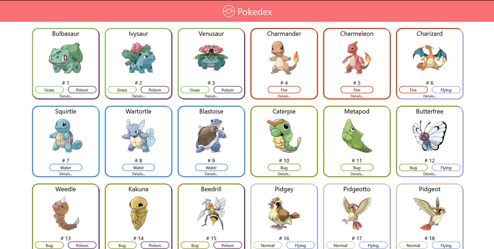
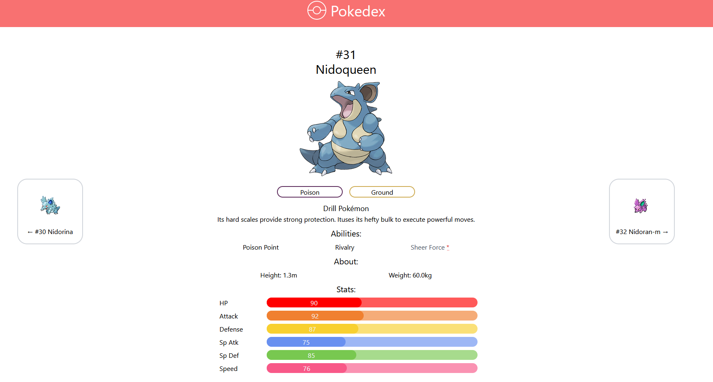
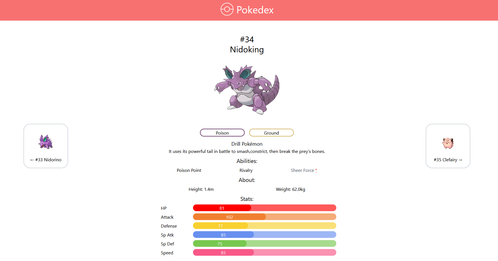

# Nuxt Pokedex!

## 👀 Project Overview 

- 😎 A small app thats use the PokeAPI to show some pokemon information 
- 🔗 You can find this project live on: https://pokedex-nuxtjs.vercel.app

## 🔥 Techs used

<div style="
    display: inline-block
">
    
    
    
</div>

## 🔧 Build Setup 

```bash
# install dependencies
$ npm install

# serve with hot reload at localhost:3000
$ npm run dev

# build for production and launch server
$ npm run build
$ npm run start

# generate static project
$ npm run generate

You can also use yarn!
```

## 📷 Project images





## 👽 External links

- 🔗 PokeApi: https://pokeapi.co/